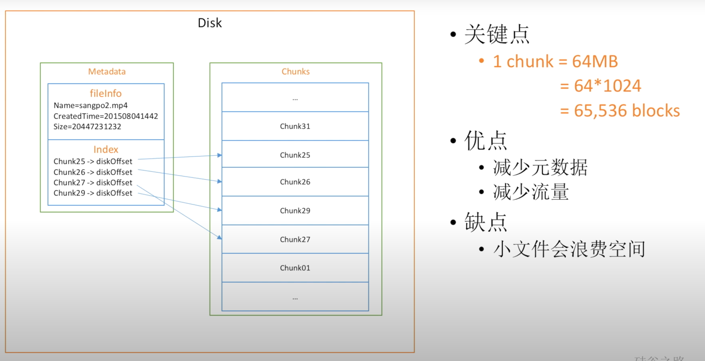
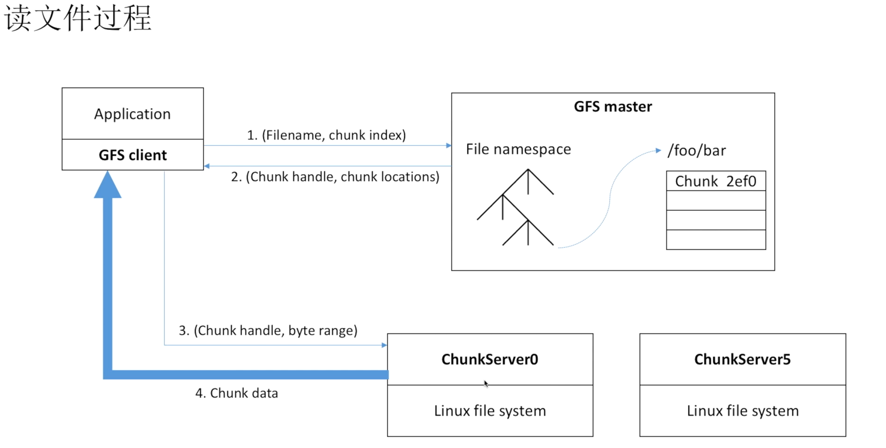
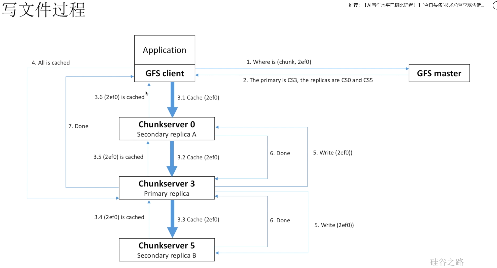

# Lecture03-04

## Paper:GFS

### 绪论

#### GFS与其他分布式文件系统的不同

* 组件失效被认为是正常的（常态）
* 单个文件很大（GB级别），从新设计I/O操作
* 文件以添加新文件的方式进行改变，而不是直接改写。
* GFS能够为许多应用提供便利。

### 设计

#### 假设/前提

* 持续检测错误，发生错误能迅速恢复
* 支持小文件，但是以大文件为主（> 100M，通常GB）
* 大流量的读取和小流量的随机读取（存储），对性能的保证通常是大流量读取
* 对多用户同时改变文件（添加）有明确的语义定义，尽可能减少同步带来的损耗
* 注重持续高带宽而不是低延迟

#### 接口

提供类似常见文件系统的操作接口：比如create, delete, open, close, read, write，特色操作：snapshot：快速复制文件或者目录树，record append：多用户同时写入文件（原子性不需要额外锁）

#### 架构

#### 单一Master

* 不会直接与Client进行数据传输，会通知Client应该与哪个chunkserver进行数据交换

#### Chunk Size

* 选择64MB，优点如下
  * 减少与master的交互，并能轻松的缓存chunk位置
  * 能够减少带宽消耗
  * 减少元数据的数据量，是我们能够把元数据保存在内存中
* 缺点
  * 可能会造成“热点”chunk server

#### 元数据

分为三类：文件名/chunk名称，file < --- >chunk映射，chunk及副本存放位置，前两者会有log保存在本地和远程，chunk存放位置不用保存，master启动时，chunk server会主动发送。

* 操作日志：保存着元数据的修改信息，非常重要，保留多分，用于master复原，为了节省复原时间，设置了checkpoint，定期总结。
* 元数据修改前必须前保存日志。

## Video：[深入浅出Google File System](https://www.youtube.com/watch?v=WLad7CCexo8)

### 如何保存文件

#### 保存大文件（单机）：

#### 保存超大文件（分布式）

**如何降低master中的元数据信息，以及减少master的通讯**：

master不会保存磁盘的偏移量，只需要保存chunk所对应的chunkserver，在chunkserver中，再查找磁盘的偏移量即可。

### 数据损坏

#### 发现数据损坏

每个blcok中保存一个checksum，进行校验。每次读取都进行hash校验

#### 减少数据损坏的损失

创建副本（三个）

如何选择副本的chunkserver：硬盘使用率低，跨机架跨数据中心

#### 如何恢复损坏的chunk

chunkserver想master求助，找到副本的位置

### Chunkserver挂掉

#### 如何发现

心跳，周期性的向master发送信息。

#### 如何恢复

master启动修复进程，根据剩余chunk的多少进行优先级排序。chunk副本越少，越先进行修复

### 热点

热点平衡进程：记录访问频率，带宽等，如果某个server访问过多，创建多个副本server

### 如何读文件

### 如何写文件

注意primary是写的时候临时指定的。

注意先缓存再写入硬盘（防止出错）

