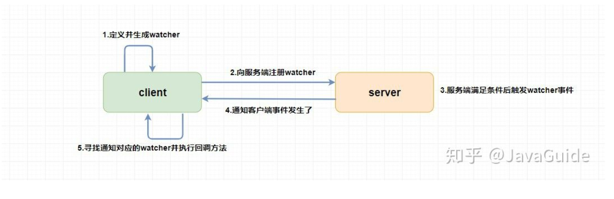
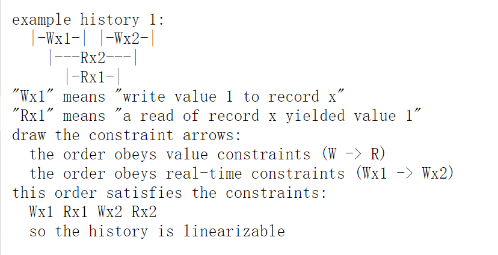

## Lecture08

## Paper: Zookeeper

### 锁

Tomcat的Java锁：同一台机器的多个进程，谁先抢到锁，谁就对数据库进行操作

分布式锁：

* 当有三个Tomcat服务器连接数据库，每个服务器都有一把锁，同一时间也可能会出现多个进程修改某一数据
* MySQL分布式锁：Insert操作保证只有一个服务器insert成功（唯一性约束），操作完成后删掉这个Insert，但是会造成死锁（前面的获得锁的进程挂掉，其余进程永久等待）
* Redis分布式锁：setnx命令（与MySQL类似），不同的是可以设置过期时间，自动删除过期锁（这会造成阻塞后的进程的锁被删掉。。。）
* MySQL+Quartz：行锁，没有获得锁的线程自动阻塞，锁被释放后自动获取。
* CAS锁：修改num之前先保存old_num，修改数据得到new_num，只有在Num是old_num的时候，我们才会对Num进行修改（compare and set思想，保证set的时候数据是没有修改的）

### 原语（primitive)

若干指令构成的程序段，执行某个特定功能不会被中断。

### Data model

多叉树结构，节点称为znode（最小数据单元），只能存1M数据（因为zookeeper本来就不是存数据用的，是用来协调服务的）。zookeeper协调分布式进程的根本：通过管理这样一个data tree，并提供znode接口给client进程，client可以自定义原语。

znode是用来**抽象服务进程**的。

**znode分为四类：**

* 持久节点：一旦创建就会一直存在(zookeeper宕机也会存在)，直到删除
* 持久顺序节点：名称有顺序性
* 临时节点：与客户端会话是创建（绑定），会话断开则节点消失，只能做叶子节点
* 临时顺序节点：名称有顺序性

**znode数据包括：stat/data**

**stat信息解释**

cZxidcreate ZXID，即该数据节点被创建时的事务 

idctimecreate time，即该节点的创建时间

mZxidmodified ZXID，即该节点最终一次更新时的事务 

idmtimemodified time，即该节点最后一次的更新时间

pZxid该节点的子节点列表最后一次修改时的事务 id，只有子节点列表变更才会更新 pZxid，子节点内容变更不会更新

cversion子节点版本号，当前节点的子节点每次变化时值增加 

1dataVersion数据节点内容版本号，节点创建时为 0，每更新一次节点内容(不管内容有无变化)该版本号的值增加 1

aclVersion节点的 ACL 版本号，表示该节点 ACL 信息变更次数

ephemeralOwner创建该临时节点的会话的 sessionId；如果当前节点为持久节点，则 ephemeralOwner=0

dataLength数据节点内容长度

numChildren当前节点的子节点个数

**ACL权限，分为5种**

CREATE : 能创建子节点
READ ：能获取节点数据和列出其子节点
WRITE : 能设置/更新节点数据
DELETE : 能删除子节点
ADMIN : 能设置节点 ACL 的权限

### Watcher机制

事件监听器，Zookeeper非常重要的特性，用户在一些节点上注册watcher，当特定事件触发后，zookeeper会将事件发送到相应客户端。

Watcher是one-time trigger,只会被出发一次后失效（session断开也会触发）

### Session

Zookeeper服务器与客户端的TCP长连接，通过心跳保证有效。sessionTimeout/sessionID（全局唯一）

### Zookeeper集群

三个就好了，通过一致性算法保证集群数据一致。最典型：主备模式(Master/Slave)，Leader提供读写，follower/observer提供读服务。

Leader选举过程（与raft有一点不同）选举 ---> 发现阶段 ---> 同步（保证一致） ---> 广播

ZooKeeper 底层其实只提供了两个功能：① 管理（存储、读取）用户程序提交的数据；② 为用户程序提供数据节点监听服务

### Zookeeper的两个guarantee

Linearizable writes : 

可线性化定义：可线性化是指所有操作必须满足真实发生的顺序，且读到的数据是最新写入的数据。用户端的操作历史是可线性化的，则说明了server提供了正确的服务。

可线性化大致等同于该server系统类似单个服务器。 

可线性化用于定义正确性。

client end history（客户端看到的操作顺序）

## Video:zookeeper

### 从副机“读”数据会出现什么问题？

可能会读到过期的数据（因为不能保证这个副机是up-to-date的），raft和lab3b，是不允许client在replica读数据的，但是zookeeper为了read性能，允许client读到过时的数据。

zookeeper如何保证不读到过期数据，阻塞client的read操作，直到read之前的writes都执行完成，或者使用sync()命令

### Test-and-Set服务器

保证不会出现脑裂，因为只有一台机器能够修改成功。

### Zookeeper的成功之处

* 提供少量原语，用户能够自定义原语

### Server如何处理重复请求

维护一个table，如果发现某请求ID的结果已经在表中（已经被执行），则不回执行resent request，而是直接返回表中结果。