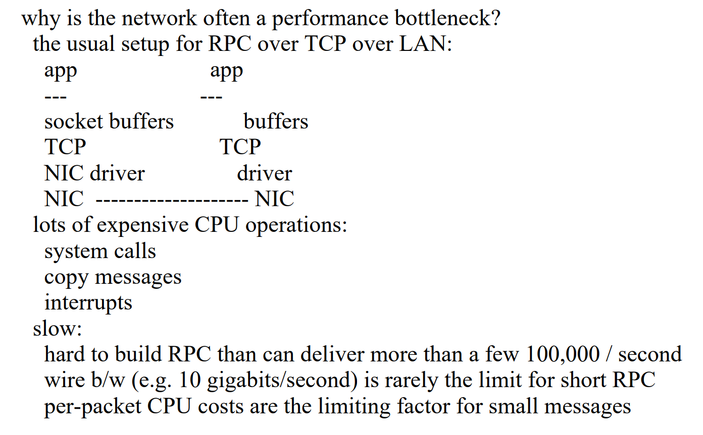
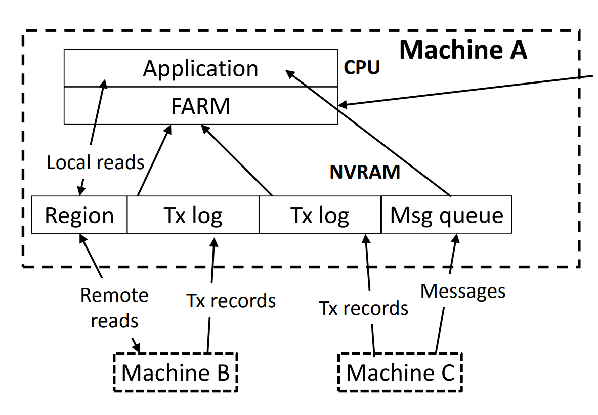
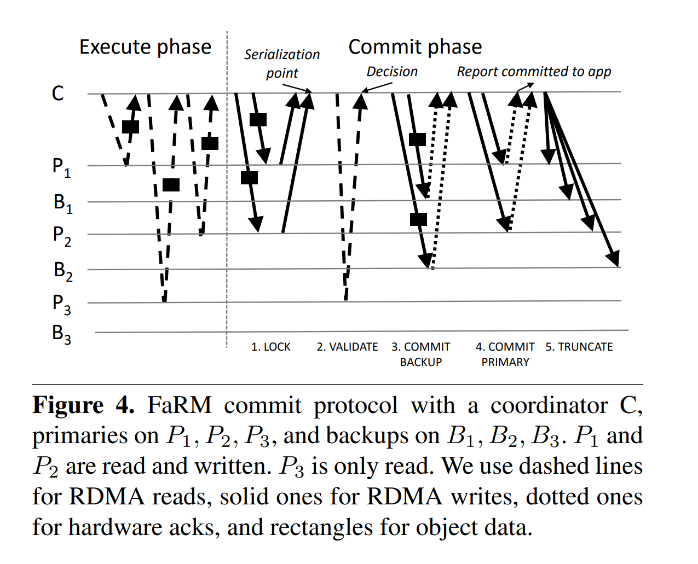
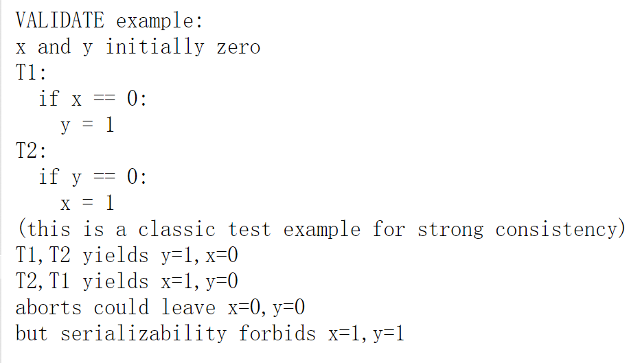
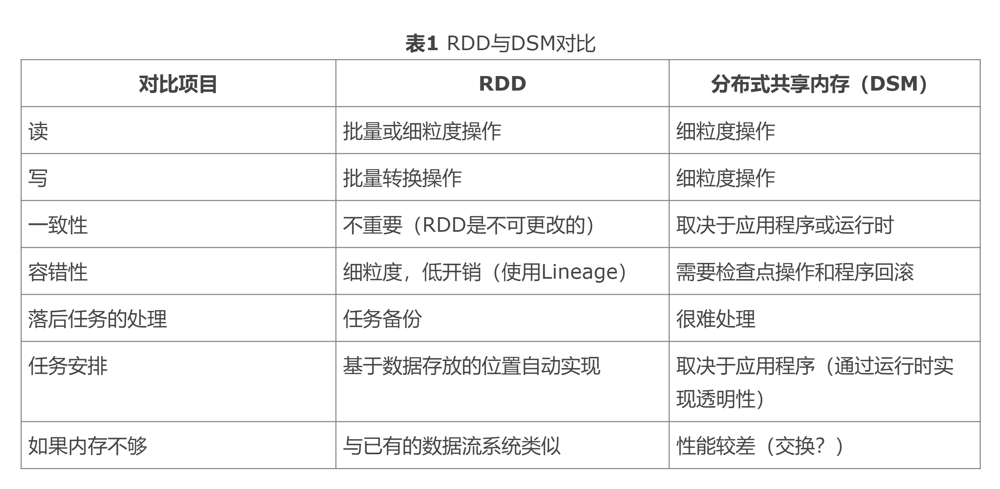

# Lecture 14

## Video

1,和spanner类似，采用replication + 2pc commit + sharding，不同点在于，spanner用于实际场景的全国范围的分布式数据库，而FaRM的副本存储在同一个DC，为了使用高性能的RDMA NIC而设计。速度上，spanner一次读写事务需要10ms，而FaRM通常只需要50多微妙。瓶颈上，Spanner的性能瓶颈在于网络延迟，而FaRM在于CPU速度。

2，FaRM设置：使用zookeeper管理集群，使用主从 replication，F+1的服务器能容忍F台宕机。

3，性能提高原因：1，分片提高并行能力。2，数据存储在非易失性RAM，读写很快。3，使用RDMA，不用造成系统中断。Kernal ByPass，应用程序直接读取网络上的数据，不用经过内核。

4，NVRAM：没有persist()，节省时间，RAM比SSD快几个数量级。如何实现非易失性？有一个备用电源，当检测到主电源断电，所有RAM立刻把数据写到与之关联的SSD中，并自动结束运行。

5，介绍RPC的包怎么在网络中传输：比较慢，涉及多层，以及数据复制，系统中断等。



6，FaRM提出了解决网络传输瓶颈的两个办法：

1，Kernal Bypass: NIC能够直接读取内存中的app data，app data也能直接传输到NIC。此时我们的app不需要经过buffer/TCP等内核的操作，得自己写这部分功能，可以借助DPDK包。（当然NIC必须支持DMA）

２，RDMA技术：能直接通过目标服务器的RDMA NIC,读取app中的数据, 提供类似TCP的功能.,也只适用于本地网络集群.

RDMA会与transaction冲突,因为可能会读到未commit的数据,或者被锁起来的数据??(RDMA也不会和软件进行任何交流?就只是直接读数据?)

**为了避免使用锁,可以(必须)用乐观并发控制(OCC):**不用锁进行读操作,写操作缓存(缓存在transaction调用方),整个事务操作结束时,有一个验证阶段,验证是否满足

**读操作非常快,用的是one-side RDMA.**

7,FaRM进行一次事务的过程(API)

txCreate()

o = tx.Read(OID)

o.x += 1

txWrite(OID, o)

ok = txCommit()

两个要注意的点:

1)OID组成:region # address,其中region表明了主从服务器的位置, address表明了RAM中要读写数据的地址

2)服务器的内存结构:



### 如何验证和提交transaction?

如何验证满足一致性呢?



执行阶段:

1, tx的发起者C需要使用one-side RDMA中p1,p2,p3中读取数据(非常快)(任何要写/修改的数据,首先也要read,获得版本号)(发起者起到了2pc中TC的角色)

Commit阶段

1,LOCK: primary会检查object的版本号和锁bit,如果版本号和从TC中传来的object版本号不一致,或者primary的object的lock bit已经上锁,则给TC返回false,否则,加锁并返回true. (注意比较版本号和Lock bit, 已经返回true/false,是一次原子性操作)(不需要等锁释放)

2,如果TC收到了全部yes, TC决定commit, TC通知全部的backup和primary. 注意当primary收到了TC可以commit的信号后,修改object的版本号,并把lock bit清空.

3,全部提交后,通知primary和backup删除此次log

Validate: 用来验证transaction中的read操作, 保证validate时(refetch时),其lock和version number都没有改变.

### 举例1

TC1和TC2并发执行 x += 1,会出现以下情况:

1, TC1和TC2同时读x发送lock phase, 此时由于原子性操作, 只会有一个TC会返回true, x最终加1

2,TC1和TC同时读x,但是TC1先commit, TC2也不会执行,因为版本号不对.

最大特点是read操作时OCC的,非常快,不需要锁.

### 举例2

验证强一致性的典型例子



如果T1和T2同步进行,则它们都会修改x = 1和 y = 1,但是在validation阶段,两个return false,从而保证线性化.


# Lecture15: Spark

## Paper:  Resilient Distributed Datasets: A Fault-Tolerant Abstraction for In-Memory Cluster Computing

### 1，概述

RDD的两个特定：1，容错特性。2，基于内存。

解决问题：循环数据流

RDD实现容错很简单：因为RDD是高度受限的只读内存模型，只能通过与其他RDD进行转换操作（map, join, group by）创建。不需要check-point和roll-back机制，它们使用Lineage重建丢失的分区。

利用RDD内在的确定性特性，创建了一种**Spark调试工具rddbg**，允许用户在任务期间利用Lineage重建RDD，然后像传统调试器那样重新执行任务

### 2，RDD概念

设计目标：为基于工作集的应用（多个并行操作重用中间结果的应用）提供抽象，并保留MapReduce的特性（自动容错/位置感知/可伸缩）。

RDD的容错方式：通过记录数据更新实现容错，为防止更新过多，RDD只支持粗粒度转换。粗粒度支持数据并行的批量分析应用,不适用于异步更新共享状态的应用.

RDD不需要物化,RDD含有如何从其他RDD衍生（即计算）出本RDD的相关信息（即Lineage），据此可以从物理存储的数据计算出相应的RDD分区。

**RDD编程模型**：

1,RDD在ｓｐａｒｋ中被表示为对象.通过对象上的方法进行调用和转换.

2,RDD通过动作，向应用程序返回值.如count/collect/save(将RDD的结果输出到存储系统),也就是说只有在动作时,才会计算RDD（延时计算）

３，可以通过缓存和分区控制RDD,缓存可以将计算好的RDD存在缓存上，加速后期重用．分区有哈希分区和范围分区两种,应用程序可以将两个RDD进行哈希分区，加速ｊｏｉｎ操作．

我所理解的RDD模型: 一种包含了对本地数据进行Lineage操作的抽象数据模型,只能通过批量操作创建(不能单独写),使用粗粒度更新,发生故障可以利用其他的RDD恢复.

与共享式内存模型对比(DSM)



## Video

分布式计算,相比于MapReduce, 对循环迭代有更好的支持,提供数据流?(dataflow). 能够将之前需要多个MapReduce的过程组合在一起。

### PageRank

```scala
	 1		val lines = spark.read.textFile("in").rdd
			//得到一个RDD对象？（类似于线性图/流程图？）不进行任何的计算
			//只有在lines.collect()时，才进行计算，如果在此处collect()，会返回in里面的数据（string形式）
     2      val links1 = lines.map{ s =>
     3        val parts = s.split("\\s+")
     4        (parts(0), parts(1))
     5      }
			//这里得到一个RDD对象，将lines转换成了map，但是也不会真正进行操作，只是线性图？
     6      val links2 = links1.distinct()
			//需要分区之间的网络交流,消除重复项
     7      val links3 = links2.groupByKey()
			//根据from URL,将link分组(可能不需要网络交流,上一步可能已经sort并把相同的key放在同一分区)
			//接下来迭代将会反复用到link3
     8      val links4 = links3.cache()
			//之前的collect,会反复读取in文件,所以需要进行cache
     9      var ranks = links4.mapValues(v => 1.0)
    10  	//把所有页面的概率初始化为1
    11      for (i <- 1 to 10) {
    12        val jj = links4.join(ranks)
        	  //大范围的重新组织数据,把ranks和links4的相同key item组合在一起,形成新的对象(如果spark把links4和ranks的相同				 //key放在一个分区就好了)
    13        val contribs = jj.values.flatMap{
    14          case (urls, rank) =>
    15            urls.map(url => (url, rank / urls.size))
    16        }
    17        ranks = contribs.reduceByKey(_ + _).mapValues(0.15 + 0.85 * _)
        	  //通过某种算法,计算出来新的rank
        	
    18      }
    19  
    20      val output = ranks.collect()
    21      output.foreach(tup => println(s"${tup._1} has rank:  ${tup._2} ."))

```

用于计算web网页的重要性。也可以表示用户访问此网站的概率。此算法不断模拟（迭代）用户的随机点击行为。最终收集的结果，会逼近网站的真正点击概率。

如果使用MapReduce，将会很麻烦和缓慢，因为一次模拟行为就需要一个mapreduce来模拟。（且不断的从GFS磁盘读写）

注意以上代码:我们并没有指定分区位置, 如何分区等操作,这些都是spark内部完成.

对象jj的值如下:


**如何在分布式系统上执行上述计算**

1, worker在HDFS上读取数据(很可能该worker就储存了多块HDFS分片)

2,对读取的数据进行map  (spark支持stream操作,也就是说读数据的时候同时Map)

3,distinct需要worker之间的通信,具体做法是,每个worker会按照fromURL(key),把数据分成多个小份存储, worker只需要从所有服务器中,把属于自己的小份取走,形成新的分区.


1,2为Narrow transformation, 服务器可以本地的对数据进行操作,不需要互相通信.

3为wide transfromation,需要服务器之间的数据传递,非常耗时.

4, spark的一个优势是,在执行操作前,已经知道所有操作的lineage graph,从而有优化的空间. 所以在gruopByKey(),可以不需要在重新分区了.

### 容错

容错是指对重新全部计算进行容错. spark的某个worker失效后,重头开始计算即可. 但存在一个问题,即该worker执行到需要wide transformation的操作时,可能需要来自其他worker的数据, spark是在内存中计算的, 此操作的结果可能被丢弃了, 为了避免其余所有的worker重新计算来产生丢弃的数据, 利用显式的persist()操作,把数据存起来.