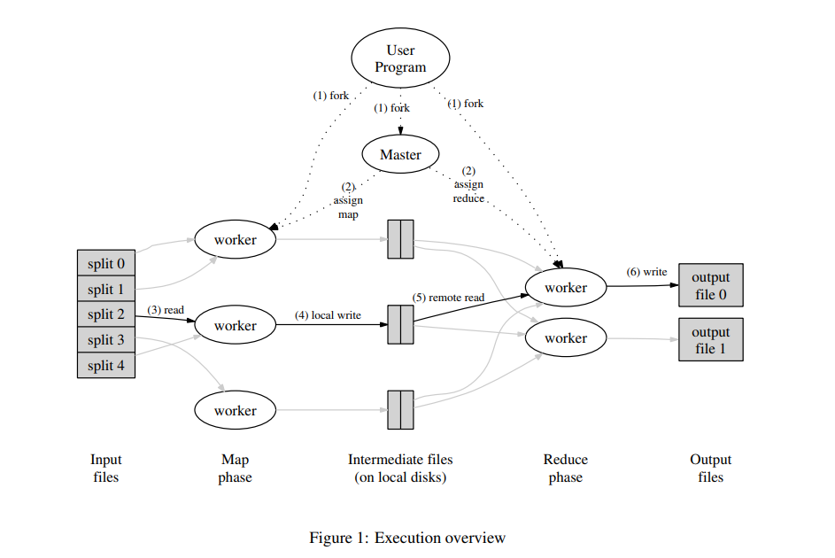

# Introduction

## Paper:  "MapReduce: SimplifiedDataProcessingonLargeClusters"

### **概述：**

使用Map和reduce函数，对数据进行拆分和合并。（使用中间值键值对在两函数间传递数据）


### **执行流程：**



1，将文件分割成M份（区域性优化，worker1会优先在存储着split1的主机上运行，一般为16~64MB一份）

2，分为master进程和woker进程，master进程控制worker执行哪些任务（任务分配优化：均衡性能）

3，woker主机执行map函数，产生**中间值键值对**并存储在其内存

4，内存中的中间值键值对，周期性的往本地磁盘存储（减少网络带宽），并分割成R份（分割优化）。

5，当master通知worker执行reduce函数时，往对应的本地磁盘远程读数据，(中间值键值对进行排序，对相同的key进行聚合)。

6，对每一个key，执行reduce函数，并写到output file（最终只有一个，利用文件系统保证？）

7，所有map和reduce函数结束，通知user程序执行完成（最后总有一些速度很慢的map worker or reduce woker，利用备份进程进行优化）

## Lecture01：Introduction

分布式的问题：

* 计算机的并发/交互困难
* 局部失效
* 获得所需性能比较困难

Lab4：将数据分片，然后并发执行？？

Lab的debug非常困难，尽早开始。

存储，通讯（tool)，计算：这些基础架构往往需要分布式。 

Dream：提供一个像非分布式的接口， 但底层是一个分布式的架构。

RPC:保证可靠的网络通信

Threads:结构化的并发操作方式

concurrency control:并发控制（顺序控制？）

1，可扩展性！！

单个存储服务器的性能很容易被消耗。大量web请求，产生大量web服务器，为了数据库服务器不产生瓶颈，需要分布式存储。

2，容错

如果有一千台主机，那几乎每天都会出现主机故障（或者网络故障）。

所以分布式系统的容错性能是非常需要的。

Availability：当发生了一些错误后，系统还是能够继续提供服务（有针对一些故障的容错机制）

Recoverbility：发生故障能够恢复。

两个工具：非易失存储（但是很难更新，恢复也很慢）复制（但是很难保持副本同步？）

解决方式：冗余主机？

3.一致性

例如分布式存储中，实现key/value的put和get，但是Key/value的表会有比较多的副本（由于容错机制），需要保证他们的一致性。

强一致性：保证get操作一定是最新的Put所更新的值（性能差，必须检查此次Get的值是最新）

弱一致性：get操作可能会读取到以前的Put操作（未被更新的值）

consistency/performance spectrum

由于容错性的要求，人们尽可能让不同的副本距离较远，从而造成Put操作的更新会很耗时。

如何保持弱一致性+高性能

MapReduce: Job = MapTasks + Reduce Tasks

可以使用流来优化reduce，而不是必须等待全部数据收集完成，才执行reduce函数

reduce的输出文件也是放在GFS上（也会消耗带宽）

## lecture 2: infra : RPC and threads

### Go语言

为什么使用Go：

* 对线程，锁，同步，RPC的使用很容易
* 垃圾回收语言，内存自动回收，多线程的内存回收很重要，因为共享对象的回收需要所有线程使用完成
* 简单

### 线程

I/O并发：统一时间段，如果某一个I/O活动正在等待，则可以允许其他I/O活动

 并行：如果启动多个GoRoutine，多核处理器能够同时处理

方便：比如周期性的检查

如果没有并发，可以用事件驱动编程？？（通常用一个循环）（有一个事件表）（这是线性的，写起来很麻烦）（无法使用多核）

线程的数据交互比进程容易的多

挑战：

共享的数据容易出错：竞争  解决办法：加锁 （锁和变量是没有任何关系的。）

协作：使用channel， sync.Cond, waitGroup

死锁：互相等待对方解锁

### Web爬虫

三种方式：串行/共享数据/channel

共享数据：防止两个Go线程同时访问同一个url，并把fetched[url]设置为true两次

```go
func ConcurrentMutex(url string, fetcher Fetcher, f *fetchState) 
```

此处对我们定义的结构fetchstate，需要用一个指针指向，但是对于Go语言自带的数据结构map，却不用指针，因为map本身就是一个指针

### RPC

远程程序调用（remote procedure call)，非常方便的C-S通讯机制，隐藏网络协议的细节，进行各种数据的传输。

一般定义三个部分：

common:声明变量和返回体

client：

* Dial:使用TCP连接服务器
* Call:请求调用服务器的函数（使用RPC库）

Server

首先定义一个函数（方法），然后将这个方法在RPC库中注册，之后server允许TCP连接。

对于RPC库，能够读取每一个请求，并为每个请求创建一个goroutine，解组请求（unmarshalls request），查找对应的处理函数，并将这个请求分派给这个函数（对象），组装请求（marshall request)，最后将请求写入TCP连接

错误处理：

如果如何知道一个请求发送失败了呢？使用best effort策略，如果一段事件没有得到响应，尝试了多次后，自动放弃并报错。

如果client多次发送统一请求